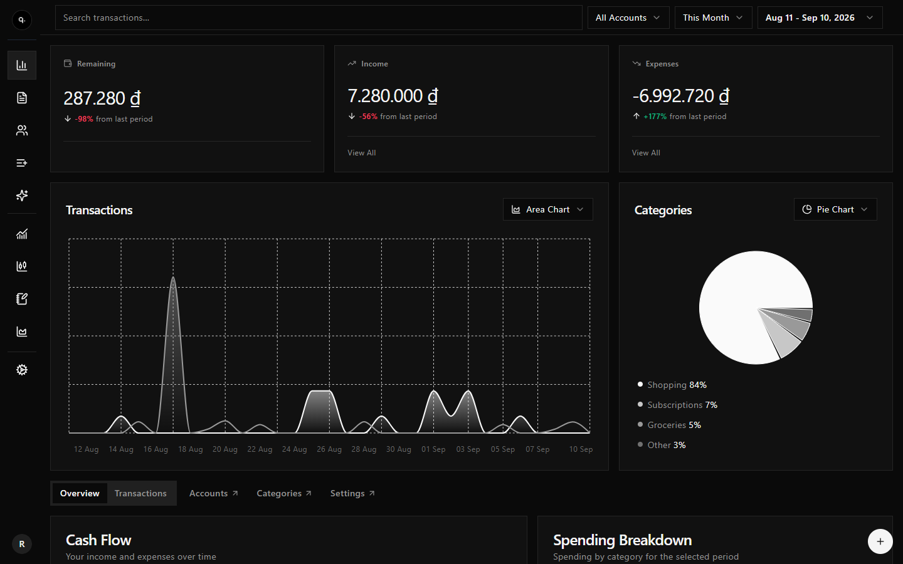
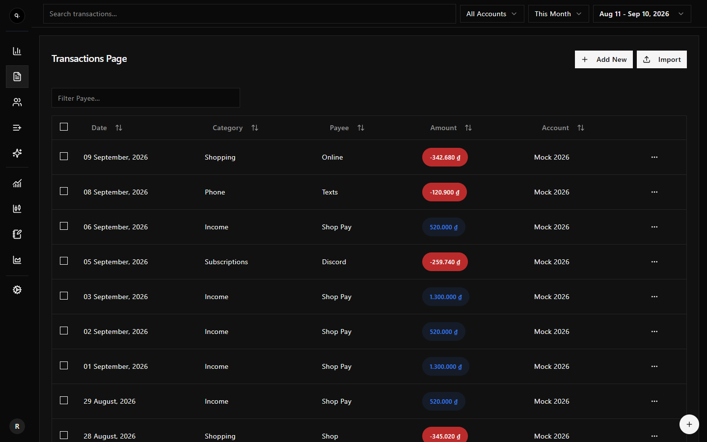
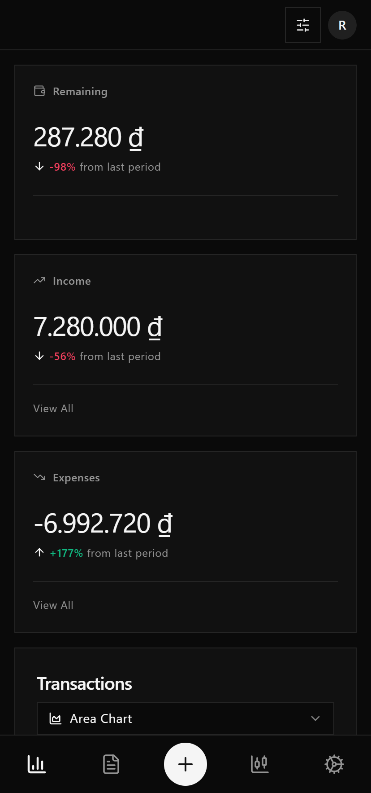
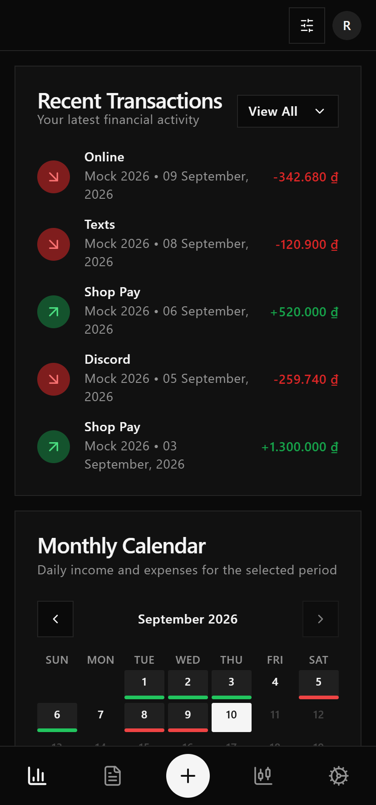

<div align="center">


# Finance Pro

**Your money and the Vietnamese market, on one screen.**

Track spending across accounts, stay on top of every subscription, and follow gold prices and Vietnamese stocks — in a fast, bilingual dashboard that works just as well on your phone.

[](https://nextjs.org)
[](https://react.dev)
[](https://supabase.com)
[](https://www.typescriptlang.org)
[](https://tailwindcss.com)
[](LICENSE)

[Features](#features) · [Screenshots](#screenshots) · [Getting started](#getting-started) · [Tech stack](#tech-stack)

<br />



</div>

## Features

### 💸 Personal finance

- **Overview at a glance** — income, expenses and what's left for any period, the change versus the period before, a cash-flow chart, spending by category and a daily calendar.
- **Transactions** — a sortable, filterable table, bulk delete, and CSV import with column mapping for your bank's exports. Add one from anywhere with the **+** button.
- **Accounts & categories** — split money across wallets and bank accounts, then filter every view by account.
- **Subscriptions** — keep recurring bills in one list and see what's due next; billing cycles are worked out for you.

### 📈 Markets

- **Vietnamese gold prices** (giavang.net) and a **VN stock price board**, powered by [vnstock-js](https://www.npmjs.com/package/vnstock-js).
- **Live TradingView widgets** — tickers, US stock and crypto heatmaps, an economic calendar.
- **News & blog** — market pulses and explainers written in MDX.

### 🧭 Investing <sup>preview</sup>

- Portfolio, stock detail and analytics screens, with AI portfolio insights from Google Gemini. These screens still run on sample data; connecting them to real holdings is next.

### 🌏 Built for everyday use

- **Vietnamese & English** interface, **VND / USD / EUR / JPY**, and dates shown in **your timezone**.
- **Light and dark** themes.
- **Mobile-first navigation** — a bottom bar with a one-tap "add transaction" button, and content that scrolls between the header and the bar.
- **Private by design** — every table is guarded by Postgres row-level security, and the API always queries *as you*, never with an admin key.

## Screenshots

<table>
  <tr>
    <td width="63%"></td>
    <td width="18.5%"></td>
    <td width="18.5%"></td>
  </tr>
  <tr>
    <td align="center"><sub>Transactions</sub></td>
    <td align="center"><sub>Overview on mobile</sub></td>
    <td align="center"><sub>Recent activity &amp; calendar</sub></td>
  </tr>
</table>

<sub>Screenshots use sample data.</sub>

## How it's built

```
Browser ──▶ Next.js (App Router)
             ├─ middleware ────── refreshes the Supabase session cookie
             └─ /api/* (Hono) ─── per-request Supabase client carrying the user's JWT
                                   └─▶ Postgres ── RLS: auth.uid() = user_id
```

- **The database decides who sees what.** The API never touches the service-role key, so row-level security — not handler code — filters every query. [`db/__tests__/rls.test.ts`](db/__tests__/rls.test.ts) signs in as two users and proves neither can read, change or forge the other's rows.
- **One round-trip for the overview.** Totals, categories and daily figures come from a single `summary()` Postgres function.
- **Time done right.** Timestamps are stored as `timestamptz`; the timezone you pick only changes how they're displayed.

## Tech stack

| Layer | Choice |
| --- | --- |
| Framework | Next.js 15 (App Router, Turbopack), React 19 |
| API | Hono with zod validation and a typed RPC client |
| Data fetching | TanStack Query |
| Database & auth | Supabase — Postgres, Auth (email + Google), row-level security |
| Schema & migrations | Drizzle ORM, drizzle-kit |
| UI | Tailwind CSS, shadcn/ui (Radix), Recharts, lucide icons |
| i18n | next-intl (vi, en) |
| Market data | vnstock-js, TradingView widgets |
| AI | Vercel AI SDK + Google Gemini |
| Tests | Vitest |

## Getting started

### Prerequisites

- Node.js **22.12+** (`.nvmrc` pins 24)
- [pnpm](https://pnpm.io)
- A [Supabase](https://supabase.com) project

### 1. Install

```bash
git clone https://github.com/ttqteo/finance-app.git
cd finance-app
pnpm install
```

### 2. Configure

```bash
cp .env.example .env
```

| Variable | Where to get it |
| --- | --- |
| `NEXT_PUBLIC_SUPABASE_URL` | Supabase → Project Settings → API |
| `NEXT_PUBLIC_SUPABASE_PUBLISHABLE_KEY` | Same page |
| `DATABASE_URL` | Supabase → Database → **Session pooler** connection string (the direct one is IPv6-only) |
| `NEXT_PUBLIC_APP_URL` | The app's public URL, e.g. `http://localhost:3001` |
| `GOOGLE_GENERATIVE_AI_API_KEY` | Google AI Studio — only needed for AI insights |
| `RLS_TEST_USER_{A,B}_{EMAIL,PASSWORD}` | Optional: two confirmed users, so the RLS test runs instead of skipping |

### 3. Set up the database

```bash
pnpm db:migrate
```

This creates the tables, the row-level security policies and the `summary()` function.

Then, in Supabase → Authentication → URL Configuration, add `http://localhost:3001/auth/callback` to the redirect URLs — email confirmations and Google sign-in land there.

### 4. Run

```bash
pnpm dev
```

Open [http://localhost:3001](http://localhost:3001) and create an account.

### Scripts

| Command | What it does |
| --- | --- |
| `pnpm dev` | Dev server on port 3001 (Turbopack) |
| `pnpm build` · `pnpm start` | Production build and server |
| `pnpm test` | Vitest — unit tests, plus the RLS suite when its variables are set |
| `pnpm lint` | ESLint via `next lint` |
| `pnpm db:generate` | Generate a migration from `db/schema.ts` |
| `pnpm db:migrate` | Apply migrations |
| `pnpm db:studio` | Browse the database in Drizzle Studio |

## Project structure

```
app/
├─ (site)/(public)/     market pages, news and blog
├─ (site)/(auth)/       sign-in, sign-up, password reset
├─ (site)/dashboard/    the app itself
├─ api/[[...route]]/    Hono API — accounts, categories, transactions, subscriptions, summary, settings
└─ auth/callback/       OAuth and email-confirmation callback
features/               per-domain API hooks, forms and sheets
components/             shadcn/ui primitives and dashboard widgets
db/                     Drizzle schema and generated Supabase types
drizzle/                SQL migrations, including RLS policies and summary()
lib/                    Supabase clients, dashboard data transforms, utilities
messages/               vi / en translations
contents/blogs/         MDX articles
```

## License

Released under the [Apache 2.0 License](LICENSE). © 2024–2026 ttqteo.
